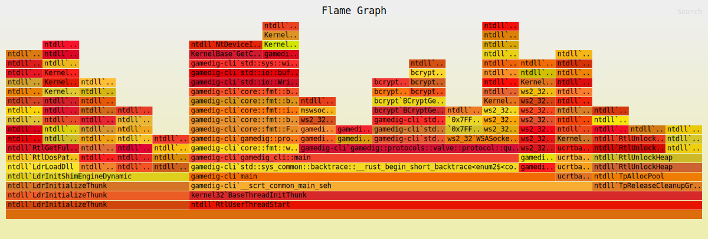

# gamedig-cli

Supported games and keys can be found in `src/key.rs`.

```console
Usage: gamedig-cli.exe --game <GAME> --ip <IP> --port <PORT>

Options:
  -g, --game <GAME>
  -i, --ip <IP>
  -p, --port <PORT>
  -h, --help         Print help
  -V, --version      Print version
```

Example:


Flamegraph for ARK server (Open svg in browser for more details):

